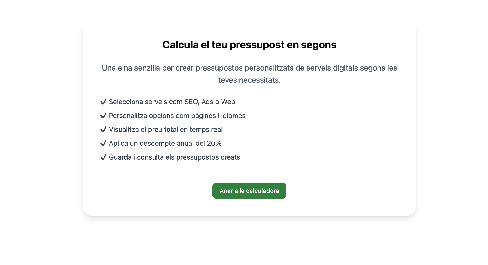
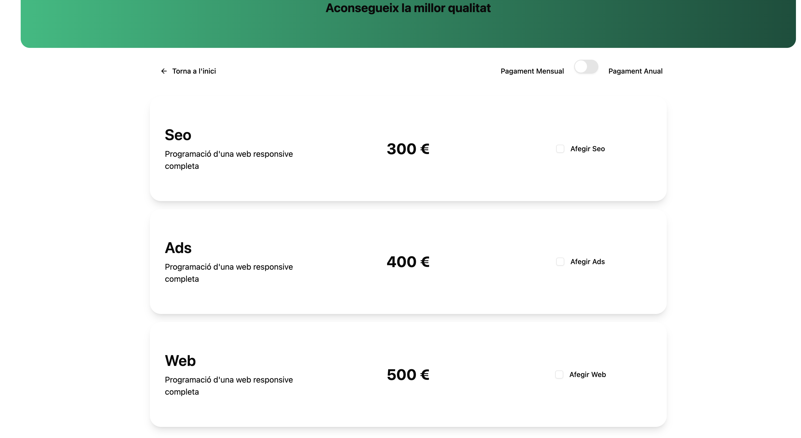
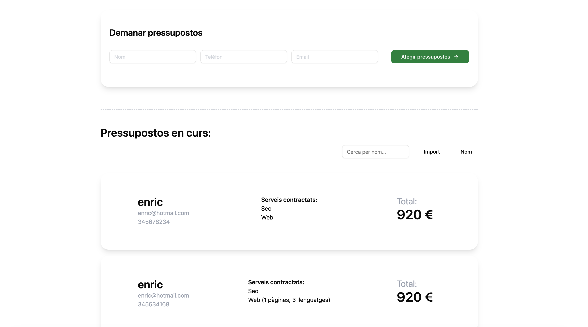

# Calculadora de Presupuestos

Aplicación de **calculadora de presupuestos** desarrollada con **React + TypeScript + Vite**, que permite crear presupuestos personalizados de servicios digitales, aplicar descuentos y gestionar opciones adicionales de forma dinámica.

El proyecto se centra en la correcta **gestión de estado**, el **cálculo reactivo de precios**, la **arquitectura de componentes** y la **navegación entre vistas mediante React Router**.

---





---

## 🚀 Tecnologías usadas

- React: 18+
- TypeScript
- Vite
- Tailwind CSS
- React Router DOM
- Context API
- Vitest
- Testing Library

---

## 📸 Funcionalidades

- Pantalla de bienvenida con explicación de la aplicación
- Navegación entre vistas mediante **React Router**
- Selección de servicios (SEO, Ads, Web)
- Personalización de servicios web (páginas, idiomas)
- Cálculo del precio total en tiempo real
- Aplicación de **descuento anual del 20%**
- Visualización clara y reactiva del presupuesto
- Interfaz limpia, accesible y responsive

---

## 🧱 Arquitectura de la aplicación

La aplicación está dividida en componentes y lógica con responsabilidades claras:

### WelcomePage
- Pantalla inicial de la aplicación
- Explica el propósito y funcionamiento de la calculadora
- Redirige a la calculadora mediante routing

### CalculatorPage
- Vista principal de la calculadora
- Renderiza los servicios disponibles
- Muestra el precio total calculado

### ServiceCard
- Representa un servicio individual
- Permite activar o desactivar el servicio
- Comunica cambios al estado global

### Context (QuoteContext)
- Gestiona el estado global de los servicios seleccionados
- Centraliza la lógica de selección y opciones
- Facilita el cálculo reactivo del total

La lógica de negocio está desacoplada de la presentación para facilitar el mantenimiento, la escalabilidad y el testing.

---

## 🧮 Cálculo del presupuesto

El precio total se calcula de forma reactiva mediante un hook personalizado:

- Se recorren los servicios seleccionados
- Se suman los precios base
- Se añaden extras (páginas, idiomas)
- Se aplica el descuento si está activo
- El total se actualiza automáticamente ante cualquier cambio

Esto garantiza una **experiencia fluida e inmediata** para el usuario.

---

## 🧭 Routing

La navegación entre vistas está implementada con **React Router**:

- `/` → Pantalla de bienvenida (`WelcomePage`)
- `/calculator` → Calculadora de presupuestos (`CalculatorPage`)

Los botones de navegación permiten moverse entre vistas sin recargar la aplicación.

---

## 📂 Estructura del proyecto

```txt
src/
├── components/
│   ├── layout/
│   │   
│   ├── ui/
|
|-- features
|    ├── quotes/
|        ├── components/
|        ├── context/
|        ├── hooks/
|        ├── services/
|        ├── types/
|        ├──utils/
├── lib/
├── pages/
├── style/

````
 
 ## 1️⃣ Clonar el repositorio
```bash
git clone https://github.com/josep100/Sprint6._Aprofundir_en_React.git
```

## 2️⃣ Acceder al directorio del proyecto

```bash
  cd tu-repositorio
```

## 3️⃣ Instalar dependencias

```bash
  npm install
```

## 4️⃣ Ejecutar la aplicación en desarrollo

```bash
  npm run dev
```

